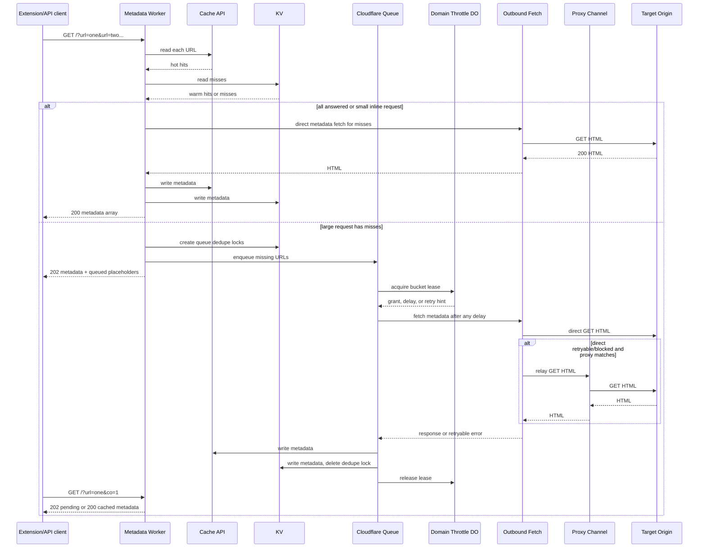
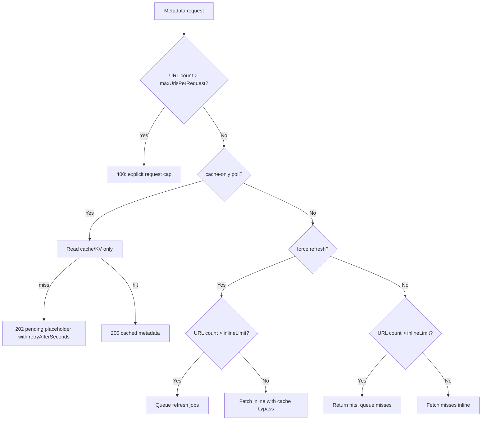
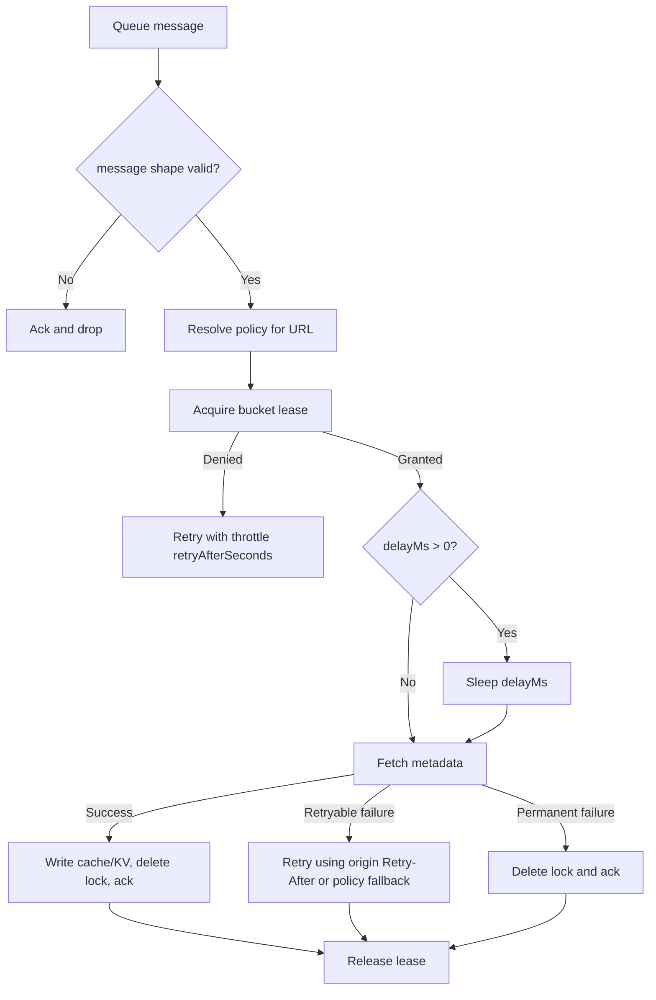
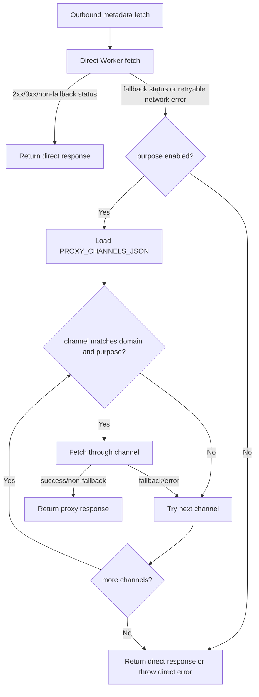

# Metadata API Architecture

This worker has one job: return useful metadata quickly without letting one import, one customer, or one hostile origin slow everything else down.

The happy path is intentionally boring:

1. Read cache.
2. Return cached metadata immediately.
3. Queue only the work that cannot be answered cheaply.
4. Pace queued origin fetches per domain bucket.
5. Try direct fetch first.
6. Use proxies only when direct fetch is retryable or blocked.
7. Write the result back to Cache API and KV.
8. Let the extension poll cache-only until queued metadata appears.

## Cast

- **Extension/API client**: asks for one URL, a tab batch, or a forced refresh.
- **Worker fetch handler**: validates the request, checks limits, reads cache, and decides inline vs queued.
- **Cache API**: hot local metadata cache.
- **KV**: global metadata cache and queue dedupe locks.
- **Queue**: accepts large hydrate/refresh work and retries at most twice, as configured in `wrangler.jsonc`.
- **MetadataDomainThrottle Durable Object**: per-bucket interval plus max-concurrency lease gate.
- **Outbound fetch layer**: direct Worker fetch first, proxy fallback second.
- **Proxy channel**: optional DataImpulse, HTTP CONNECT provider, fetch API relay, or service binding relay.
- **R2**: stores imported media and opt-in rewritten metadata images.

## Main Flow

## Queue Decision

## Queue Worker Story

The important invariant: a granted lease is released in `finally`, including retryable failures.

## Proxy Fallback Story

Proxies are not a normal path. They are a recovery path.

## Dry Runs

### 1. One Cached URL

- Request: `GET /?url=https://example.com/a`
- Worker checks Cache API.
- If hot, returns `200` with `isCachedResponse: true`.
- No queue, no Durable Object, no origin fetch, no proxy.

### 2. One Uncached URL

- Request is under `inlineLimit`.
- Worker fetches origin inline.
- If direct fetch succeeds, metadata is parsed and written to Cache API and KV.
- Client receives `200` immediately.

### 3. Fresh Import Of 100 Tabs

- Request is over `inlineLimit` but under `maxUrlsPerRequest`.
- Worker reads Cache API and KV for all URLs.
- Cached URLs return as metadata.
- Missing URLs become queue messages with `mode: "hydrate"`.
- Response is `202`, with placeholders containing `metadataJobId`, `metadataClientKey`, `metadataBucket`, `metadataPriority`, and `retryAfterSeconds`.
- Extension creates local items immediately and polls with `co=1`.
- Queue workers hydrate metadata in the background.

### 4. Ten Users Import 100 Tabs Each

- Each request returns quickly after cache lookup and enqueue.
- Queue backlog grows, but request latency stays bounded by cache/KV and queue writes.
- Domain throttle buckets prevent one hot origin from consuming all fetch capacity.
- Different buckets can progress independently.

### 5. Force Refresh Of A Large Batch

- Request has `re=1` and URL count is over `inlineLimit`.
- Worker queues `mode: "refresh"` instead of scraping inline.
- Existing cached metadata can be included in the response, but placeholders mark refresh status.
- Queue fetch bypasses metadata cache and overwrites fresh cache results.

### 6. Cache-Only Poll Before Job Finishes

- Extension calls `GET /?url=...&co=1`.
- Worker reads Cache API and KV only.
- If still missing, returns `202` pending placeholder and a retry hint.
- It does not enqueue duplicate work.

### 7. Domain Bucket Saturated

- Queue message reaches consumer.
- Durable Object sees `activeLeases >= maxConcurrent`.
- Message is retried with the throttle retry delay.
- No origin fetch happens.
- No lock is deleted, because the job still exists.

### 8. Origin Returns 429

- Direct fetch returns `429`.
- If a matching proxy channel exists and purpose is enabled, the worker tries the proxy.
- If proxy succeeds, metadata is parsed and cached.
- If all proxies fail, the queue message retries when the error is retryable.
- Cloudflare Queue enforces max retries from `wrangler.jsonc`.

### 9. Proxy Disabled

- Direct fetch returns `429`.
- `PROXY_CHANNELS_JSON` is missing or no channel matches.
- Worker returns the direct `429` for inline requests.
- Queue jobs retry when the status is configured as retryable.

### 10. Oversized Request

- URL count exceeds `maxUrlsPerRequest`.
- Worker returns `400` with `maxUrlsPerRequest` and `receivedUrls`.
- It never silently truncates URLs.

### 11. Permanent Queue Failure

- Message is valid and lease is granted.
- Metadata processing throws a non-retryable error.
- Queue deletes the dedupe lock and acknowledges the message.
- This prevents a poisoned item from looping forever.

### 12. Media Import

- `POST /import-media` requires `IMPORT_MEDIA_TOKEN`, unless local/dev explicitly sets `ALLOW_UNAUTH_IMPORT_MEDIA=1`.
- Remote media fetch uses direct fetch first and optional proxy fallback for `media-import`.
- Uploaded media is returned as a worker-hosted `/r2/...` URL, not a custom public bucket domain.

## Debug Map

| Symptom | First place to inspect | Expected clues |
| --- | --- | --- |
| Request returns `400` | Worker response JSON | `maxUrlsPerRequest`, malformed/missing `url` |
| Request returns `202` forever | KV/cache and queue consumer logs | Is the queue bound? Are messages retrying? Is origin blocked? |
| Queue backlog grows | Queue metrics and Durable Object logs | One hot bucket may be saturated; inspect `metadataBucket` and policy throttle |
| Many duplicate queued placeholders | KV dedupe lock TTL | Check `queue.lockTtlSeconds`; duplicates should be skipped, not re-enqueued |
| Direct fetch blocked | Worker logs around proxy fallback | Look for direct status, matching channel, purpose, and channel failures |
| Proxy spend spikes | `PROXY_ENABLED_PURPOSES` and channel domains | Images/media may be enabled too broadly |
| Extension polls too fast | Response `Retry-After` and entry `retryAfterSeconds` | Policy may be too aggressive for that domain |
| Metadata appears stale after refresh | Queue mode and cache-only poll | Refresh must be `mode: refresh`; poll should use `co=1`, not `re=1` |
| R2 media URL points to old domain | Response payload | New uploads should use `/r2/<key>` on the worker origin |

## Operational Invariants

- Large imports and large refreshes must queue.
- Cache-only polling must never enqueue.
- Proxies must be opt-in and purpose-scoped.
- Domain behavior must come from `METADATA_POLICY_JSON`, not source code.
- Every granted queue lease must release.
- Retryable failures retry; permanent failures ack and unlock.
- Request caps are explicit errors, never silent truncation.
- Media import is authenticated by default.

## Config Boundary

Use source code for generic mechanics:

- cache read/write
- queue message shape
- throttle lease protocol
- direct/proxy fallback order
- request validation

Use environment config for deployment:

- `METADATA_POLICY_JSON`
- `PROXY_CHANNELS_JSON`
- `PROXY_ENABLED_PURPOSES`
- `PROXY_FALLBACK_STATUSES`
- proxy credentials
- media import token

